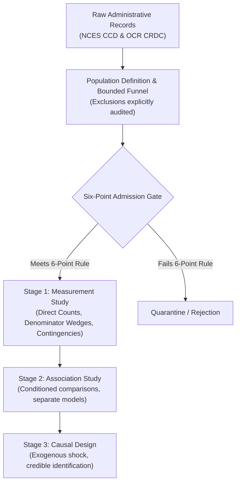

# Measuring Educational Opportunity: Proxy Definitions, Participation Indicators, and Denominator Divergence (`2026-10-09-crdc-opportunity-measurement`)

An empirical measurement study and observational pilot evaluating how administrative proxy definitions, survey skip logic, and denominator choices shape educational opportunity metrics across Missouri public high schools.

---

## 1. Project Overview & Empirical Motivation

When policymakers, parents, and researchers evaluate secondary school quality, they rely on administrative indicators:
- *"Does a school offer Advanced Placement (AP)?"*
- *"Do students have access to foundational STEM coursework like Physics or Computer Science?"*

However, empirical evaluation routinely breaks down across three distinct measurement vulnerabilities:
1. **Indicator Interpretation**: Survey indicators often measure reported *student participation/enrollment* during a given school year rather than institutional *course catalog offerings*, fundamentally altering what questions can be credibly answered.
2. **Proxy Blind Spots**: Relying on an AP-only measure blinds researchers to parallel institutional routes (such as Dual Enrollment and dual credit partnerships).
3. **Denominator Divergence**: Reporting unweighted institutional availability (*"a third of high schools report no physics classes"*) describes a vastly different population than reporting student exposure (*"less than a fifth of students attend those schools"*), because course offerings scale directly with school enrollment size.

This computational sketchbook implements a disciplined **Six-Point Study Admission Gate** and carries out three bounded empirical measurement studies using official administrative records from the **2021–22 Civil Rights Data Collection (CRDC)** and **NCES Common Core of Data (CCD)**.

---

## 2. The Six-Point Study Admission Gate

Before specifying regressions or attempting causal inference, empirical work must satisfy this six-point admission gate:

1. **Retrieval & Usability**: The underlying records are retrieved, and required fields contain audited, usable values.
2. **Fixed Population & Denominator**: Population boundaries, exclusions, and denominators are fixed in code and narrative prior to analysis.
3. **Written Calculation/Model**: The calculation or statistical estimator is written down explicitly.
4. **Directional Neutrality**: A result of any direction—including no difference or an unexpected null—substantively answers the question.
5. **Audited Sensitivity Check**: Remaining structural uncertainty (such as conflicting inter-agency reporting or administrative data suppression) is bounded by a specified sensitivity check.
6. **Scholarly & Survey Integrity**: The exact contribution is checked against prior literature and official survey documentation.

### Research Stage Demarcation



---

## 3. Bounded Population Accounting Funnel

Our target population is **regular public high schools serving exactly grades 9–12 in Missouri during SY 2021–22**.

| Stage | Cohort Description | Count | Excluded | Retained | Rationale / Exclusions |
| :---: | :--- | :---: | :---: | :---: | :--- |
| **1** | Missouri Regular Public Schools (CCD) | 2,298 | 0 | 100.0% | State universe of open regular schools |
| **2** | Classified Exactly Grades 9–12 & Open (CCD) | 318 | 1,980 | 13.8% | Excludes elementary, middle, combined 7–12, and inactive schools |
| **3** | Matched to CRDC Records | 317 | 1 | 99.7% | 1 school (*Hawthorn High School* in Kansas City, `290060803317`) missing in CRDC |
| **4** | Consistent Grades 9–12 Reporting in CRDC | **307** | 10 | 96.5% | Baseline study sample; all 4 grades reported "Yes", others "No" |
| **Sensitivity** | Quarantined Conflicting Grade-Span Records | **10** | — | — | Retained for broad sensitivity checks (total N=317) |

### The 10 Quarantined Conflicting Schools:
- *Rock Bridge Sr. High, David H. Hickman High, Muriel W. Battle High School, Central High, Doniphan High*: Reported Preschool (`PS`) alongside grades 9–12.
- *Bourbon High School, Gallatin High, Mound City High*: Reported K–12 (`PS, KG, G01–G12`).
- *Grain Valley High*: Reported Ungraded (`UG`) alongside grades 9–12.
- *Carnahan School of the Future*: Reported grades 10–12 (`G10–G12`).

---

## 4. Master Findings Scorecard

| Study | Narrow Question | Baseline (N=307) | Sensitivity (N=317) | Delta | Substantive Conclusion |
| :--- | :--- | :---: | :---: | :---: | :--- |
| **Study 1 (Metric A)** | Dual Enrollment rate among schools reporting No AP | **92.9%**<br>(105 / 113) | **93.1%**<br>(108 / 116) | +0.18 pp | Among schools with no AP participation, 93% report college-level pathways through dual credit. |
| **Study 1 (Metric B)** | Miss rate of AP indicator among schools with either route | **35.1%**<br>(105 / 299) | **35.0%**<br>(108 / 309) | -0.17 pp | An AP-only measure misses over a third of high schools active in college-level coursework. |
| **Study 2** | Curricular concealment: No AP Computer Science within AP | **65.5%**<br>(127 / 194) | **64.2%**<br>(129 / 201) | -1.28 pp | An umbrella AP label conceals that nearly two-thirds of AP high schools report zero AP CS enrollment. |
| **Study 3** | Denominator divergence: School availability vs. Student exposure in Physics | **14.70 pp**<br>(32.90% vs 18.20%) | **15.27 pp**<br>(33.12% vs 17.85%) | +0.57 pp | Institutional availability diverges from student exposure by ~15 pp because zero-physics schools are systematically smaller. |

---

## 5. Granular Study Summaries

### Study 1 (Pilot): AP vs. Dual-Enrollment Opportunity Blind Spots
- **Survey Documentation Fact**: CRDC items `SCH_APENR_IND` and `SCH_DUAL_IND` measure *reported student enrollment/participation*, not mere course catalog listings.
- **The Four-Cell Participation Matrix (N=307)**:
  - *Neither Route*: **8 schools (2.6%)** *(Note: this does not establish an absence of all college pathways, as schools may offer IB, CTE articulation, or local college arrangements).*
  - *Dual Enrollment Only*: **105 schools (34.2%)**
  - *AP Only*: **14 schools (4.6%)**
  - *Both Routes*: **180 schools (58.6%)**
- **Metric A (Conditional on No AP)**: Among 113 high schools reporting no AP participation, **105 (92.9%)** report dual-enrollment participation (108 of 116, or 93.1%, in sensitivity check).
- **Metric B (Miss Rate Among Either Route)**: Among the 299 high schools reporting at least one advanced course route, **105 (35.1%)** report dual enrollment but no AP participation and are missed by an AP-only measure.
- **Epistemic Scope**: Quantifies the divergence between AP-only and dual-credit opportunity measures. Does *not* evaluate course quality, transferability of credits, or student completion benefits.

### Study 2: Curricular Concealment in AP (The Case of Computer Science)
- **The Epistemic Problem**: Umbrella indicators reward schools for any AP offering, concealing whether high-demand technical courses report student enrollment.
- **Key Finding**: Among 194 AP-participating high schools, **127 (65.5%)** report zero student enrollment in AP Computer Science during 2021–22. Only 67 schools report students taking AP Computer Science.
- **Sensitivity Check**: 129 of 201 AP-participating schools (64.2%) report no AP CS participation.
- **Epistemic Scope**: Demonstrates that school-level umbrella labels systematically conceal subject-level enrollment absence. Does not establish that schools completely lacked course catalog listings or student interest.

### Study 3: The Denominator Wedge (Schools vs. Students in Physics Provision)
- **Handling Source Codes**: CRDC enrollment fields disaggregate by sex (`TOT_ENR_M`, `TOT_ENR_F`, `TOT_ENR_X`). Across the 307 schools, `TOT_ENR_X` contains 304 instances of `-9` (Not Applicable / Skipped) and 1 instance of `-12` (Suppressed for Privacy at Central High School, KCPS). Negative codes are audited and clipped at zero, yielding **provisional calculations from released counts** while holding the single suppressed record unresolved.
- **Key Finding**:
  - $P_{\text{school}}$: 101 of 307 schools (**32.90%**) report zero physics classes.
  - $P_{\text{student}}$: 41,616 of 228,637 released students (**18.20%**) attend those schools.
  - **Denominator Divergence**: **14.70 percentage points** ($32.90\% - 18.20\%$).
- **Institutional Scale Driver**: Zero-physics schools average **412 students** (median 280), whereas physics-offering schools average **908 students** (median 728).
- **Epistemic Scope**: Neither denominator inherently overstates the other; they describe different populations (administrative units vs. individual learners). The result demonstrates how denominator choice changes this description.

---

## 6. Directory Architecture

```text
2026-10-09-crdc-opportunity-measurement/
├── README.md                           # Master scorecard and reproduction guide
├── docs/
│   ├── methodological_framework.md     # The Six-Point Admission Gate & research stages
│   ├── crdc_documentation_notes.md     # Survey question text & administrative code mechanics
│   └── literature_context.md           # Prior research context on AP, dual enrollment, and physics
├── data/
│   ├── raw/                            # Extracted Missouri-specific subsets from CCD & CRDC
│   │   ├── mo_ccd_directory_2021_22.csv
│   │   ├── mo_crdc_school_char_2021_22.csv
│   │   ├── mo_crdc_ap_2021_22.csv
│   │   ├── mo_crdc_dual_2021_22.csv
│   │   ├── mo_crdc_physics_2021_22.csv
│   │   ├── mo_crdc_computer_science_2021_22.csv
│   │   └── mo_crdc_enrollment_2021_22.csv
│   └── processed/
│       ├── mo_high_school_crdc_measurement_panel_2021_22.parquet # Master tidy panel (318 rows)
│       ├── mo_high_school_crdc_measurement_panel_2021_22.csv
│       ├── population_exclusion_funnel.csv
│       ├── study1_ap_dual_summary.csv
│       ├── study2_ap_cs_concealment.csv
│       └── study3_physics_denominator_wedge.csv
├── src/
│   ├── build_panel.py                  # Panel construction pipeline with strict source code auditing
│   ├── analyze_measurement.py          # Standalone analytical replication script
│   ├── generate_figures.py             # Generates publication figures for artifacts/
│   └── build_notebook.py               # Generates and executes the Jupyter notebook
├── notebooks/
│   └── 01_measuring_educational_opportunity.ipynb # Executed interactive research notebook
├── tests/
│   └── test_replication_accounting.py  # 5-test pytest suite validating source codes & counts
└── artifacts/
    ├── fig1_ap_dual_contingency.png    # 4-cell matrix & dual opportunity metrics
    ├── fig2_ap_cs_concealment.png      # AP Computer Science reported participation
    └── fig3_physics_denominator_wedge.png # School vs student denominator divergence & scale
```

---

## 7. Reproduction Instructions

To reproduce all datasets, tests, figures, and executed notebook from scratch:

```powershell
# 1. Build the harmonized measurement panel and population funnel
python 2026/2026-10-09-crdc-opportunity-measurement/src/build_panel.py

# 2. Run the analytical verification script
python 2026/2026-10-09-crdc-opportunity-measurement/src/analyze_measurement.py

# 3. Generate high-resolution figures
python 2026/2026-10-09-crdc-opportunity-measurement/src/generate_figures.py

# 4. Run the automated pytest replication suite
pytest 2026/2026-10-09-crdc-opportunity-measurement/tests/test_replication_accounting.py -v

# 5. Build and execute the interactive Jupyter Notebook
python 2026/2026-10-09-crdc-opportunity-measurement/src/build_notebook.py
```
