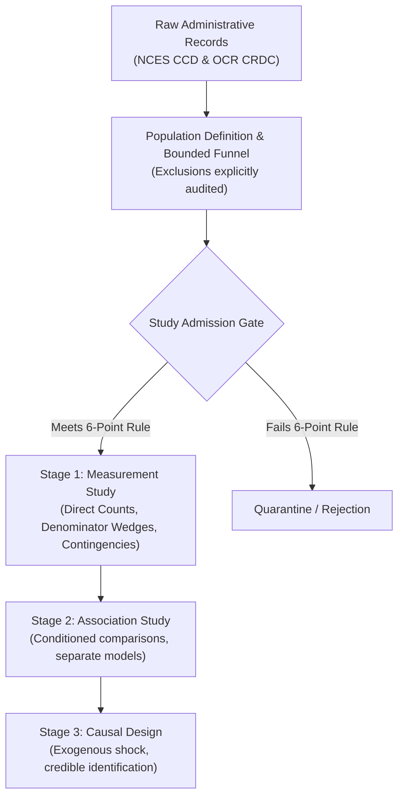

# Methodological Framework: Disciplined Measurement Studies in Education Data

This document articulates the epistemic philosophy and governance rules underlying the **Missouri High School Opportunity Measurement Observatory** (`2026-10-09-crdc-opportunity-measurement`).

---

## 1. The Core Problem: Scaffolding vs. Concrete Evidence

Education policy research frequently suffers from two opposing pathologies:
1. **Volumetric Speculation**: Generating expansive causal claims and regressions before establishing basic population boundaries, denominator fidelity, or survey definitions.
2. **Definitional Blindness**: Equating bureaucratic proxy indicators (e.g., "School reports AP participation") with substantive programmatic access, institutional quality, or student benefit.

To prevent both errors, this repository establishes a disciplined demarcation between **measurement studies**, **association studies**, and **causal effect studies**.

---

## 2. The Six-Point Study Admission Rule

Before any study is declared feasible or executed, it must satisfy this six-point admission gate:

1. **Retrieval & Validity**: The records are retrieved, and the required fields contain usable, audited values.
2. **Fixed Population & Denominator**: The population boundaries and denominator definitions are fixed in code and text prior to running calculations.
3. **Written Calculation/Model**: The calculation or statistical model is written down explicitly.
4. **Directional Neutrality**: A result of any direction—including zero difference or an unexpected null—answers the core question.
5. **Audited Sensitivity Check**: Remaining structural uncertainty (e.g., conflicting reporting across agencies) is addressed with a small, specified sensitivity check.
6. **Scholarly Positioning**: The exact contribution is checked against prior literature and established survey documentation.

---

## 3. Demarcation of Research Stages

### Stage 1: Measurement Studies (This Project)
- **Goal**: Measure how choices of definitions, proxy indicators, exclusions, and denominators shape our description of reality.
- **Statistical Machinery**: Direct counts, proportions, contingency matrices, and percentage-point difference wedges.
- **Role of Regressions / Sampling CIs**: A conventional regression or sampling confidence interval adds little here. We are analyzing the identified census of schools for one reporting wave. The primary uncertainty stems from **reporting accuracy, survey definition shifts, exclusions, and denominator choices**, which sampling error calculations do not resolve.

### Stage 2: Association Studies (Future Branch)
- **Goal**: Characterize how course offerings correlate with school size, geographic locale, racial composition, or poverty.
- **Statistical Machinery**: Stratified subpopulation tabulations, multivariate regressions, and demographic decompositions.
- **Admission Requirement**: Explicit pre-registration of comparison groups and model specifications.

### Stage 3: Causal Effect Studies (Strictly Separate)
- **Goal**: Estimate whether adding an AP or dual-enrollment course causes increases in college matriculation, degree completion, or labor market wages.
- **Admission Requirement**: Credible quasi-experimental or experimental design (e.g., border discontinuities, lottery admissions, policy thresholds).

---

| Study | Narrow Question | Data Fields | Statistical Path | Epistemic Boundary |
| :--- | :--- | :--- | :--- | :--- |
| **Study 1 (Pilot)** | 1) Dual Enrollment rate among schools reporting no AP participation? 2) Miss rate of AP indicator among schools with either route? | NCES CCD Directory; CRDC AP & Dual Enrollment participation indicators | 4-cell cross-tabulation; conditional percentage calculation (105/113 = 92.9% and 105/299 = 35.1%) | Quantifies how AP-only metrics miss dual enrollment pathways. Does not evaluate course quality, credit transfer, or exhaust other routes (IB/CTE). |
| **Study 2** | Among schools reporting AP participation, what percentage reported zero AP Computer Science participation? | CRDC AP indicator (`SCH_APENR_IND`) & AP CS indicator (`SCH_APCOMPENR_IND`) | Subpopulation restriction to AP schools; conditional percentage (127/194 = 65.5%) | Establishes reported participation absence under umbrella indicators. Does not measure course catalog listings or teacher credentials. |
| **Study 3** | Does the percentage of schools reporting zero physics classes differ from the percentage of students attending those schools? | CRDC Physics class count (`SCH_SCICLASSES_PHYS`) & released student enrollment (`crdc_released_enrollment`) | Unweighted school percentage vs. enrollment-weighted percentage; difference divergence (32.90% vs 18.20% released; 14.70 pp divergence) | Demonstrates divergence between institutional availability and student exposure due to school size. Provisional from released counts (1 suppressed record unresolved). |

