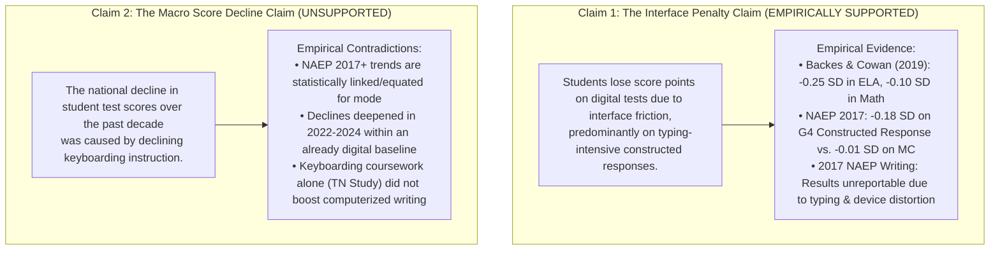

# The Keyboard Penalty: Device Ubiquity, Keyboarding Coursework Collapse, and Digital Assessment Mode Effects (`2026-10-09-keyboarding-mode-effects`)

An empirical and psychometric computational observatory investigating whether digital standardized assessments introduce an interface score penalty on keyboard-intensive questions, and evaluating the evidence linking this to the historical decline in formal keyboarding instruction.

---

## 1. Project Overview & Empirical Motivation

Over the past two decades, primary and secondary education in the United States underwent three simultaneous transformations:
1. **Device Ubiquity**: U.S. public schools expanded individual computer access to **88.0%** of schools by 2024–25 (NCES School Pulse Panel).
2. **Keyboarding Coursework Collapse**: The proportion of high school graduates earning course credit in keyboarding collapsed from **44.1% in 2000 to 2.5% in 2019** (NCES High School Transcript Study, Table 1)—a **94.3%** structural decline.
3. **Universal Digital Assessment Mandates**: State testing consortia (PARCC, Smarter Balanced) and federal monitoring assessments (NAEP reading and mathematics in 2017) transitioned from paper-and-pencil assessments (PBA) to digitally based assessments (DBA).

This creates an acute measurement tension: **Does requiring students to demonstrate academic abilities through digital interfaces introduce construct-irrelevant measurement error, particularly for younger students on constructed-response items?**

---

## 2. Epistemic Demarcation: Claim 1 vs. Claim 2

To maintain scientific integrity, this project enforces an absolute demarcation between two distinct empirical claims:



### The Six-Point Study Admission Gate
1. **Retrieval & Usability**: Underlying administrative records (NCES HSTS Table 1, NCES Pulse 2025, EdWeek 2024, ICILS 2018/2023, NAEP 2017) are retrieved, verified, and structured into reproducible tabular datasets.
2. **Fixed Population & Denominator**: Analytical populations are explicitly bounded prior to analysis.
3. **Written Mathematical Model**: The classical test theory error decomposition ($X = T + E_{\text{interface}} + \epsilon$) is explicitly specified.
4. **Directional Neutrality**: Null findings (such as multiple-choice items showing zero mode penalty, or standalone typing courses showing null writing gains) substantively answer the research question without bias.
5. **Audited Sensitivity Check**: Cross-study variation in mode penalties (Massachusetts $-0.25$ SD vs. South Carolina $-0.09$ SD vs. Tennessee $+0.04$ SD) is bounded and contextualized.
6. **Scholarly & Survey Integrity**: Full transparency regarding NAEP's official decision to suppress the 2017 Writing assessment due to insurmountable device comparability failures.

---

## 3. Master Findings Scorecard

| Analysis Domain | Specific Question | Empirical Estimate | Source / Reference | Substantive Conclusion |
| :--- | :--- | :---: | :--- | :--- |
| **Longitudinal Keyboarding** | Did high school keyboarding credits decline? | **44.1% $\to$ 2.5%**<br>($-94.3\%$ relative) | NCES HSTS Table 1 (2000–2019) | Dedicated high school typing coursework has virtually vanished. |
| **Device Access** | Did school computing device access expand? | **23.0% $\to$ 88.0%**<br>($+282.6\%$ relative) | NCES School Pulse Panel (2013–2025) | Near-universal 1:1 student device penetration was achieved. |
| **Digital Literacy** | Did student digital competence improve? | **519 $\to$ 482 pts**<br>($-37$ pts, $-0.37$ SD) | IEA ICILS (2018–2023) | Touchscreen ubiquity did not produce functional computer literacy. |
| **State Mode Penalty** | How large was the initial online penalty? | **$-0.25$ SD (ELA)**<br>**$-0.10$ SD (Math)** | Backes & Cowan (2019, MA PARCC) | Substantial initial penalty; ELA penalty was 2.5x larger than math. |
| **Format Wedge** | Does question format drive the penalty? | **$-0.17$ SD Wedge**<br>($-0.18$ CR vs. $-0.01$ MC) | NCES NAEP 2017 Mode Study (Grade 4) | The mode penalty at Grade 4 is concentrated on typed items. |
| **Developmental Wedge**| Does age attenuate the penalty? | **$+0.10$ SD Attenuation**<br>($-0.18$ G4 vs. $-0.08$ G8) | NCES NAEP 2017 Mode Study | Older students recover 55.6% of the constructed-response penalty. |
| **Equity Gradient** | Do low-income students suffer larger penalties? | **2.0x Instruction Disparity**<br>(36% vs. 18% in K–2) | EdWeek 2024 / Fordham SC Study | Disadvantaged students receive less early instruction and larger penalties. |
| **Keyboarding Intervention**| Does typing instruction raise writing scores? | **$+0.04$ SD (p = 0.48)**<br>(Null Effect) | Tennessee Middle School Study (NBEA) | Standalone typing drills alone do not boost computerized writing scores. |

---

## 4. Key Visual Exhibits

### Figure 1: The Infrastructure Paradox (2000–2025)
*Universal 1-to-1 Device Access vs. Keyboarding Coursework Collapse vs. ICILS Digital Literacy Drop.*  


### Figure 2: Standardized Mode Penalties Across Benchmark Studies
*Effect sizes separated by subject, question format (Multiple Choice vs. Constructed Response), and grade level.*  


### Figure 3: Keyboarding Instruction Pipeline, Equity, and Teacher Expectations
*Delivery models (EdWeek 2024), poverty disparity in early grades, and 4th-grade teacher competence reports (NAEP 2017).*  


### Figure 4: Psychometric CIV Simulation
*Typing speed (WPM) bottleneck and Grade 4 score distribution distortion under construct-irrelevant interface variance.*  


---

## 5. Directory Architecture

```text
2026-10-09-keyboarding-mode-effects/
├── README.md                           # Master investigation overview & scorecard
├── docs/
│   ├── research_design.md              # Psychometric model, 6-point gate, hypotheses
│   ├── literature_synthesis.md         # Comprehensive review of mode effects & typing literature
│   └── data_provenance.md              # Primary source registry, citations, and table references
├── data/
│   ├── raw/
│   │   ├── nces_hsts_2019_table1.csv   # NCES HSTS 2000-2019 coursework credits
│   │   ├── nces_pulse_device_access.csv # NCES Pulse 1:1 device penetration (2013-2025)
│   │   ├── edweek_keyboarding_survey_2024.csv # EdWeek 2024 delivery models (N=404)
│   │   ├── edweek_equity_breakdown_2024.csv   # EdWeek 2024 K-12 poverty gradient
│   │   ├── mode_effects_literature_meta.csv   # Empirical meta-analytic benchmark panel
│   │   ├── icils_cil_trends_2018_2023.csv     # IEA ICILS 8th grade scores & SES gap
│   │   ├── naep_g4_teacher_keyboarding_2017.csv # 2017 NAEP G4 teacher expectations
│   │   └── naep_g4_student_keyboard_competence_2017.csv # % students meeting expectations
│   └── processed/
│       ├── master_mode_effects_benchmark.parquet
│       ├── master_mode_effects_benchmark.csv
│       ├── keyboarding_longitudinal_panel.csv
│       └── construct_irrelevant_variance_simulation.parquet
├── src/
│   ├── acquire_datasets.py             # Data acquisition, cleaning, and validation
│   ├── analyze_mode_effects.py         # Statistical analysis, CTT/IRT decomposition, contrasts
│   ├── generate_figures.py             # Publication-quality multi-panel visualization suite
│   └── build_notebook.py               # Generates and executes the research notebook
├── notebooks/
│   └── 01_keyboarding_mode_effects.ipynb # Fully executed, interactive 2.6MB research notebook
├── tests/
│   └── test_data_integrity.py          # Pytest verification suite (6 passing tests)
└── artifacts/
    ├── figures/
    │   ├── fig1_three_divergent_trends.png
    │   ├── fig2_mode_penalty_by_subject_and_format.png
    │   ├── fig3_naep_grade4_cr_penalty_and_teacher_expectations.png
    │   └── fig4_psychometric_civ_simulation.png
    └── tables/
        ├── table1_hsts_course_trends.csv
        ├── table2_mode_effects_meta.csv
        ├── table3_edweek_instruction_equity.csv
        └── table4_research_agenda_matrix.csv
```

---

## 6. How to Reproduce

All data pipelines, test suites, figures, and executed notebooks can be fully reproduced using Python 3.12:

```bash
# 1. Acquire and validate raw datasets
python src/acquire_datasets.py

# 2. Run automated test suite
pytest tests/test_data_integrity.py -v

# 3. Perform statistical analysis and generate summary tables
python src/analyze_mode_effects.py

# 4. Generate publication figures
python src/generate_figures.py

# 5. Build and execute the Jupyter notebook
python src/build_notebook.py
jupyter nbconvert --to notebook --execute --inplace notebooks/01_keyboarding_mode_effects.ipynb
```
