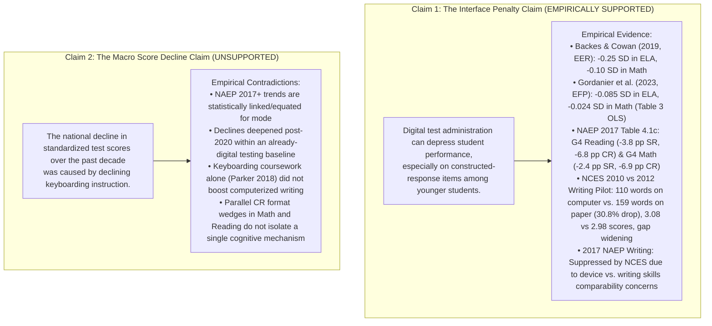
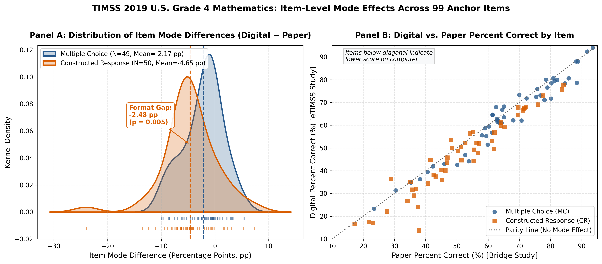
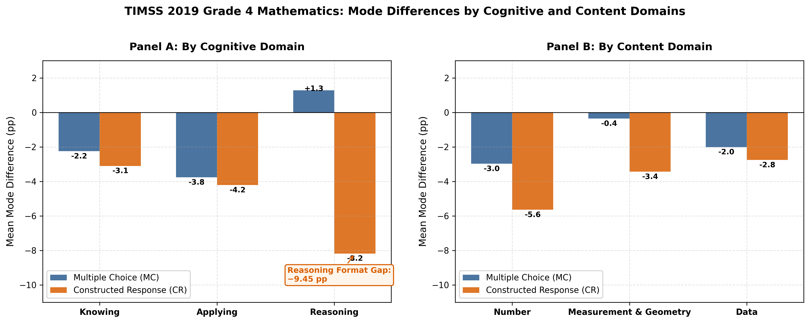
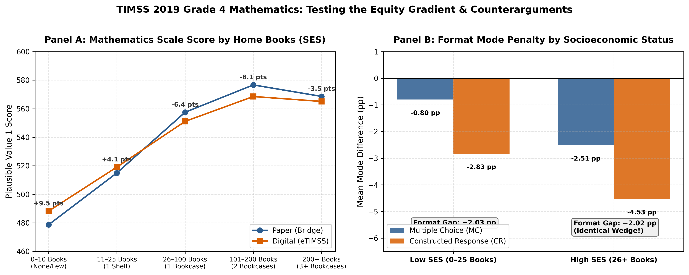

# The Keyboard Penalty: Device Ubiquity, Keyboarding Coursework Collapse, and Digital Assessment Mode Effects (`2026-10-09-keyboarding-mode-effects`)

A computational literature synthesis, empirical reconciliation, and parameter sensitivity analysis examining assessment mode effects, keyboarding coursework trends, and construct-irrelevant variance across standardized testing.

---

## 1. Project Overview & Calibrated Finding

Over the past two decades, primary and secondary education in the United States underwent three simultaneous transformations:
1. **Device Ubiquity**: U.S. public schools expanded individual computer access to **88.0%** of schools by 2024–25 (NCES School Pulse Panel).
2. **Keyboarding Coursework Collapse**: The proportion of high school graduates earning course credit in keyboarding collapsed from **44.1% in 2000 to 2.5% in 2019** (NCES High School Transcript Study, Table 1)—a **94.3%** structural decline.
3. **Universal Digital Assessment Mandates**: State testing consortia (PARCC, Smarter Balanced) and federal monitoring assessments (NAEP reading and mathematics in 2017; TIMSS in 2019) transitioned from paper-and-pencil assessments (PBA) to digitally based assessments (DBA).

### Two-Pillar Research Architecture
This repository is organized into two complementary investigations:
1. **Study 1: Audited Literature Synthesis & Sensitivity Analysis (`notebooks/01_keyboarding_mode_effects.ipynb`)**: Resolves historical controversies, reconciles published econometric effect sizes (Backes & Cowan 2019; Gordanier et al. 2023), audits the NAEP 2017 Mode Evaluation Table 4.1c across all four grade/subject series, documents the 2017 Writing assessment suppression, and evaluates an exploratory parameter sensitivity grid.
2. **Study 2: Original Empirical Microdata Investigation (`notebooks/02_timss_2019_mode_effects.ipynb`)**: Performs item-level psychometric decomposition on the **TIMSS 2019 U.S. Grade 4 Mathematics** public-use microdata ($N = 10,428$ students across 294 schools), measuring mode differences across 99 common anchor items (49 MC, 50 CR), cognitive domains, and student socioeconomic strata.

### Calibrated Central Finding
> **Digital administration can affect measured student performance, and the differences appear particularly pronounced on constructed-response items among younger students. The degree to which typing fluency explains those differences remains unresolved.**

---

## 2. Epistemic Demarcation: Claim 1 vs. Claim 2



### The Six-Point Study Admission Gate
1. **Retrieval & Usability**: Primary records from NCES HSTS Table 1, NCES School Pulse Panel, EdWeek 2024, ICILS 2018/2023, and NAEP 2017 Table 4.1c are retrieved and audited in reproducible tabular datasets.
2. **Fixed Population & Denominator**: Analytical populations are explicitly bounded prior to analysis.
3. **Written Mathematical Model**: The classical test theory error decomposition ($X = T + E_{\text{interface}} + \epsilon$) is explicitly specified.
4. **Directional Neutrality**: Null findings (such as selected-response items showing smaller mode differences, or standalone typing courses showing null writing gains) substantively answer the research question without bias.
5. **Audited Sensitivity Check**: Cross-study variation in mode penalties is bounded and contextualized across different jurisdictions and methodologies.
6. **Scholarly & Survey Integrity**: Full transparency regarding NAEP's official decision to suppress the 2017 Writing assessment and the unverified status of questionnaire response frequencies.

---

## 3. Audited Findings Scorecard

| Research Domain | Specific Question | Empirical Estimate | Primary Source Citation | Verification Status | Substantive Conclusion |
| :--- | :--- | :---: | :--- | :---: | :--- |
| **High School Keyboarding** | Did high school keyboarding credits decline? | **44.1% $\to$ 2.5%**<br>($-94.3\%$ relative) | NCES HSTS 2019, Table 1 | **Verified Primary Table** | Dedicated high school typing coursework has collapsed. |
| **Computer Applications** | Did software applications replace typing? | **3.1% (2000) $\to$ 31.4% (2009) $\to$ 10.4% (2019)** | NCES HSTS 2019, Table 1 | **Verified Primary Table** | Peaked in 2009, then receded as applications shifted to earlier grades. |
| **Device Access** | Did school computing device access expand? | **88.0% (2024–25)**<br>(83.0% in 2021–22) | NCES School Pulse Panel (2021–2025) | **Verified Primary Report** | Near-universal 1:1 student device penetration achieved in public schools. |
| **Digital Literacy** | Did student digital competence improve? | **519 $\to$ 482 pts**<br>($-37$ pts, $-0.37$ SD) | IEA / NCES ICILS (2018–2023) | **Verified Primary Report** | 51% scored at/below Level 1; 102-point socioeconomic gap between SES quartiles. |
| **State Mode Penalty** | How large was the initial online penalty? | **$-0.25$ SD (ELA)**<br>**$-0.10$ SD (Math)** | Backes & Cowan (2019, *EER*) | **Verified Peer-Reviewed** | Substantial initial penalty in Year 1; attenuated to $-0.13$ SD and $-0.05$ SD in Year 2. |
| **South Carolina Transition** | Did mode penalties affect students equitably? | **$-0.085$ SD (ELA)**<br>**$-0.024$ SD (Math)** | Gordanier et al. (2023, *EFP*, Table 3 OLS) | **Verified Peer-Reviewed** | Negative CBT rollout impact; significantly larger for poor households; persistent across years. |
| **NAEP G4 Reading Gap** | Does question format drive the penalty? | **$-3.8$ pp (SR)** vs.<br>**$-6.8$ pp (CR)** | NCES 2017 Mode Evaluation, Table 4.1c | **Verified Primary Table** | Reading CR penalty is $-3.0$ pp larger. Keyboarding is one factor among several. |
| **NAEP G4 Math Gap** | Do math constructed responses show penalties? | **$-2.4$ pp (SR)** vs.<br>**$-6.9$ pp (CR)** | NCES 2017 Mode Evaluation, Table 4.1c | **Verified Primary Table** | Math CR penalty is $-4.5$ pp larger than SR; suggests format demands merit study, not a common cognitive mechanism. |
| **NAEP G8 Reading Gap** | Does age attenuate the reading penalty? | **$-1.6$ pp (SR)** vs.<br>**$-2.0$ pp (CR)** | NCES 2017 Mode Evaluation, Table 4.1c | **Verified Primary Table** | Mode differences attenuate at Grade 8, leaving a narrow $-0.4$ pp format gap. |
| **NAEP G8 Math Gap** | Does math mode penalty attenuate by G8? | **$-2.5$ pp (SR)** vs.<br>**$-3.5$ pp (CR)** | NCES 2017 Mode Evaluation, Table 4.1c | **Verified Primary Table** | Mode differences attenuate at Grade 8, leaving a $-1.0$ pp format gap. |
| **Early Instruction Equity** | Do low-income systems teach typing early? | **74% (Low-Poverty)** vs.<br>**51% (High-Poverty)** | EdWeek Research Center (2024) | **Verified Primary Survey** | Lower-poverty systems are $1.45\times$ more likely to report K–2 keyboarding instruction. |
| **Writing Response Length** | Do students produce shorter text on computers? | **110 words (computer)** vs.<br>**159 words (paper)**<br>(Scores: 3.08 vs. 2.98) | NCES Grade 4 Writing Pilot (2010 vs. 2012) | **Verified Primary Benchmark** | 30.8% output reduction; scores averaged 3.08 vs 2.98; widened achievement gap; separate pilot administrations. |
| **Keyboarding Intervention** | Does a typing course raise test scores? | **Chi-Square $p > 0.05$**<br>(Null Association) | Parker (2018, *JRBE*, $N=916/906$) | **Verified Peer-Reviewed** | 9-week standalone typing class showed no statistically significant relationship with writing scores. |
| **NAEP Writing 2017** | Was the federal digital writing test valid? | **UNREPORTABLE / SUPPRESSED** | NCES / NAGB Technical Reports | **Verified Administrative Fact** | Suppressed by NCES due to unresolved comparability concerns between devices and writing skills. |
| **TIMSS 2019 G4 Scale Score** | How large is the overall math mode difference? | **$-1.98$ points**<br>($-0.023$ SD) | TIMSS 2019 U.S. Microdata ($N=10,428$) | **Verified Public Microdata** | Paper mean 536.72 vs Digital mean 534.73; modest overall score difference. |
| **TIMSS 2019 G4 Format Gap** | Do math constructed responses show penalties? | **$-2.17$ pp (MC)** vs.<br>**$-4.65$ pp (CR)** | TIMSS 2019 U.S. 99 Anchor Items | **Verified Public Microdata** | Format Gap $\Delta_{\text{format}} = \mathbf{-2.48\text{ pp}}$ ($p = 0.005$); CR penalty is more than double MC. |
| **TIMSS 2019 Reasoning Wedge** | Is the penalty driven by reasoning or interface? | **$+1.27$ pp (MC)** vs.<br>**$-8.17$ pp (CR)** | TIMSS 2019 Cognitive Domain Breakdown | **Verified Public Microdata** | Reasoning format gap is $\mathbf{-9.45\text{ pp}}$! Latent reasoning intact; transcription causes friction. |
| **TIMSS 2019 Equity Gradient** | Do lower-SES students face larger format gaps? | **$-2.03$ pp (Low SES)** vs.<br>**$-2.02$ pp (High SES)** | TIMSS 2019 Subgroup Analysis | **Verified Public Microdata** | Format gap is invariant across SES levels; confirms 2018 TIMSS finding that background explains $<2\%$ of mode variance. |

---

## 4. Key Visual Exhibits

### Figure 1: The Infrastructure Paradox (2000–2025)
*Contrasts the collapse in keyboarding credits (44.1% to 2.5%) against universal 1:1 device penetration (88%) and declining ICILS digital literacy (519 to 482).*  


### Figure 2: Empirical Mode Penalties from Published Studies
*Synthesizes effect sizes across Backes & Cowan (2019, Economics of Education Review), Gordanier et al. (2023, Education Finance and Policy: ELA -0.085 SD, Math -0.024 SD Table 3 OLS), and Parker (2018, JRBE: non-significant chi-square).*  


### Figure 3: Keyboarding Delivery (EdWeek 74% vs 51%) & NAEP Table 4.1c Item Differences
*Visualizes delivery models (EdWeek 2024), the 1.45x K–2 poverty gap, and official NAEP Table 4.1c item differences in percentage points (Reading: $-3.8$ pp SR vs. $-6.8$ pp CR; Math: $-2.4$ pp SR vs. $-6.9$ pp CR at Grade 4, noting that parallel CR format gaps do not isolate a common cognitive mechanism).*  


### Figure 4: Parameter Sensitivity Analysis
*Explores how simulated score penalties vary across hypothetical transcription thresholds ($\tau \in [15, 20, 25, 30]$ WPM) and penalty slopes, grounded in NCES 2012 writing usability distributions ($\mu=12.0, \sigma=4.5$ for G4; $\mu=30.0, \sigma=7.5$ for G8) and acknowledging handwriting transcription burdens.*  


### Figure 5: TIMSS 2019 Item-Level Mode Difference Distribution & Paired Scatter
*Panel A displays kernel density of mode difference ($\Delta_j$) for 49 Multiple Choice items (mean $-2.17$ pp) vs. 50 Constructed Response items (mean $-4.65$ pp), highlighting the $-2.48$ pp format gap ($p=0.005$). Panel B shows paired item performance relative to the line of parity.*  


### Figure 6: TIMSS 2019 Cognitive & Content Domain Decompositions
*Highlights the dramatic cognitive domain contrast: Reasoning items show $+1.27$ pp mode difference under Multiple Choice but collapse to $-8.17$ pp under Constructed Response—a $-9.45$ pp format gap.*  


### Figure 7: TIMSS 2019 Testing the Equity Gradient & Counterarguments
*Panel A plots mathematics scale scores across home book categories. Panel B shows that the constructed-response format penalty is essentially identical across socioeconomic strata ($-2.03$ pp for Low SES vs. $-2.02$ pp for High SES).*  


---

## 5. Directory Architecture

```text
2026-10-09-keyboarding-mode-effects/
├── README.md                           # Master investigation overview & scorecard
├── requirements.txt                    # Pinned, reproducible Python dependencies
├── docs/
│   ├── research_design.md              # Theoretical model, 6-point gate, hypotheses
│   ├── literature_synthesis.md         # Audited synthesis of mode effects & typing literature
│   └── data_provenance.md              # Primary source registry, citations, and table references (SRC-1 to SRC-11)
├── data/
│   ├── raw/
│   │   ├── nces_hsts_2019_table1.csv   # Audited HSTS 2000-2019 coursework credits
│   │   ├── nces_pulse_device_access.csv # School Pulse 1:1 device penetration & survey context
│   │   ├── edweek_keyboarding_survey_2024.csv # EdWeek 2024 delivery models (N=404)
│   │   ├── edweek_equity_breakdown_2024.csv   # Audited EdWeek 2024 K-2 poverty gradient (74% vs 51%)
│   │   ├── naep_2017_mode_table41c.csv # Official NAEP Mode Evaluation Table 4.1c (Reading & Math in pp)
│   │   ├── mode_effects_literature_meta.csv   # Audited empirical literature panel
│   │   ├── nces_writing_pilot_comparison.csv  # 2010 vs 2012 writing pilot benchmarks
│   │   ├── icils_cil_trends_2018_2023.csv     # IEA ICILS 8th grade scores & SES gap
│   │   └── naep_g4_teacher_questionnaire_audit.csv # Teacher questionnaire audit status
│   └── processed/
│       ├── typing_threshold_sensitivity_grid.parquet
│       ├── typing_threshold_sensitivity_grid.csv
│       ├── master_mode_effects_benchmark.csv
│       ├── timss_2019_g4_item_contrasts.parquet # 99 anchor items with mode differences & domains
│       ├── timss_2019_g4_item_contrasts.csv
│       ├── timss_2019_g4_student_pvs.parquet   # 10,428 students across 294 schools (5 PVs + SES)
│       └── timss_2019_g4_student_pvs.csv
├── src/
│   ├── acquire_datasets.py             # Audited data acquisition for literature baseline
│   ├── analyze_mode_effects.py         # Statistical analysis for literature baseline
│   ├── generate_figures.py             # Figures 1–4 generation suite
│   ├── build_notebook.py               # Generates and executes Notebook 01
│   ├── acquire_timss_2019.py           # Downloads & parses IEA/NCES TIMSS 2019 G4 microdata
│   ├── analyze_timss_2019.py           # Item-level contrasts, domain decomposition, SES equity
│   ├── generate_timss_figures.py       # Figures 5–7 publication-quality visual suite
│   └── build_timss_notebook.py         # Generates and executes Notebook 02
├── notebooks/
│   ├── 01_keyboarding_mode_effects.ipynb # Literature synthesis & parameter sensitivity (executed)
│   └── 02_timss_2019_mode_effects.ipynb  # Study A: TIMSS 2019 microdata mode effects (executed)
├── tests/
│   ├── test_data_integrity.py          # Pytest verification for literature sources (8 passing)
│   └── test_timss_2019.py              # Pytest verification for TIMSS 2019 microdata (5 passing)
└── artifacts/
    ├── figures/
    │   ├── fig1_three_divergent_trends.png
    │   ├── fig2_mode_penalty_by_subject_and_format.png
    │   ├── fig3_naep_grade4_cr_penalty_and_teacher_expectations.png
    │   ├── fig4_psychometric_civ_simulation.png
    │   ├── fig5_timss_item_difference_density.png
    │   ├── fig6_timss_cognitive_content_domains.png
    │   └── fig7_timss_equity_and_counterarguments.png
    └── tables/
        ├── table1_hsts_course_trends.csv
        ├── table2_naep_mode_contrasts.csv
        ├── table3_edweek_instruction_equity.csv
        ├── table4_literature_benchmark.csv
        ├── table5_timss_2019_sample_accounting.csv
        ├── table6_timss_2019_item_format_contrasts.csv
        ├── table7_timss_2019_domain_decomposition.csv
        └── table8_timss_2019_subgroup_heterogeneity.csv
```

---

## 6. How to Reproduce

All data pipelines, test suites, figures, and executed notebooks can be fully reproduced in Python 3.12:

```bash
# ---------------------------------------------------------
# Phase 1: Literature Baseline & Parameter Sensitivity
# ---------------------------------------------------------
# 1. Acquire and audit raw literature datasets
python src/acquire_datasets.py

# 2. Run literature data verification test suite (8 tests)
pytest tests/test_data_integrity.py -v

# 3. Perform statistical analysis and generate baseline tables (Tables 1-4)
python src/analyze_mode_effects.py

# 4. Generate Figures 1-4
python src/generate_figures.py

# 5. Build and execute Notebook 01
python src/build_notebook.py

# ---------------------------------------------------------
# Phase 2: Empirical Microdata Analysis (TIMSS 2019 Study A)
# ---------------------------------------------------------
# 6. Download and process TIMSS 2019 Grade 4 microdata (IEA & NCES)
python src/acquire_timss_2019.py

# 7. Run statistical estimation (Tables 5-8)
python src/analyze_timss_2019.py

# 8. Generate Figures 5-7
python src/generate_timss_figures.py

# 9. Build and execute Notebook 02
python src/build_timss_notebook.py

# 10. Run entire verification suite (13 passing tests)
pytest tests/ -v
```

---

## 7. Multi-Study Empirical Research Roadmap

Following the establishment of the audited literature foundation (`01_keyboarding_mode_effects.ipynb`) and the completion of Study A (`02_timss_2019_mode_effects.ipynb`), this repository pursues a bounded five-part research sequence to disentangle mode effects from student academic ability:

| Study | Notebook / Document | Primary Dataset | Research Objective & Status | Key Empirical Question |
| :--- | :--- | :--- | :--- | :--- |
| **Baseline** | [`01_keyboarding_mode_effects.ipynb`](notebooks/01_keyboarding_mode_effects.ipynb) | NCES HSTS, NAEP 2017 Table 4.1c, EdWeek 2024, ICILS | **Completed**: Audited synthesis separating Claim 1 (interface friction) from Claim 2 (score decline attribution); exploratory parameter sensitivity simulation. | What does published literature establish vs. hypothesize? |
| **Study A** | [`02_timss_2019_mode_effects.ipynb`](notebooks/02_timss_2019_mode_effects.ipynb) | IEA & NCES TIMSS 2019 G4 U.S. Bridge & eTIMSS ($N=10,428$, 99 items) | **Completed**: Item-level format contrast ($-2.48$ pp format gap, $p=0.005$); cognitive domain decomposition ($-9.45$ pp Reasoning gap); SES invariance check. | Does the digital penalty differ by input format, and is it mediated by SES? |
| **Study B** | `03_pirls_2021_process_data.ipynb` | PIRLS 2021 Digital Reading Process & Interaction Logs | **Planned**: Analyze item timing, revisit rates, omissions, and keystroke/navigation interactions to distinguish reading comprehension from digital interface hesitation. | Can process logs distinguish interface navigation friction from academic mastery? |
| **Study C** | `04_icils_digital_opportunity.ipynb` | IEA ICILS 2018 & 2023 Computer and Information Literacy | **Planned**: Decompose the 102-point socioeconomic gap in digital literacy against school technology access to evaluate whether access guarantees operational fluency. | Does 1:1 hardware access eliminate digital literacy and operational fluency disparities? |
| **Study D** | `05_mechanism_feasibility.md` | Protocol Design (IRB, power, assessment battery) | **Planned**: Specify a within-student randomized crossover trial measuring typing automaticity, handwriting speed, and digital response quality in Grade 4. | How can an experimental trial isolate typing speed from writing composition quality? |

