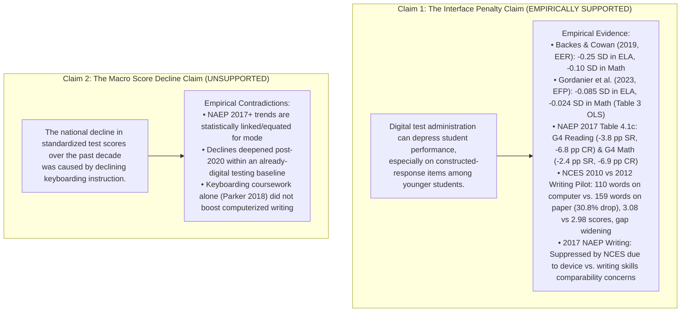
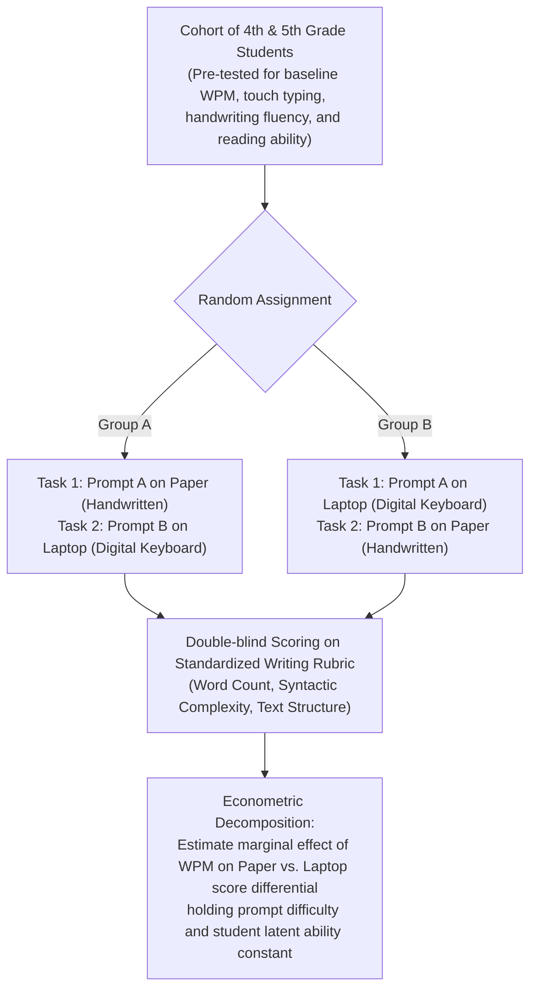

# Research Design & Theoretical Framework: Keyboarding, Digital Assessments, and Measurement Error (Audited Edition)

A computational literature synthesis, empirical reconciliation, and parameter sensitivity analysis examining assessment mode effects, keyboarding coursework, and construct-irrelevant variance.

---

## 1. Project Reclassification & Scope

To prevent misinterpreting this observatory, we formally state its empirical scope:
- **What this project is**: A **computational literature synthesis, descriptive empirical reconciliation, and parameter sensitivity analysis**. It compiles and reconciles published findings from peer-reviewed studies (Backes & Cowan 2019; Gordanier et al. 2023; Parker 2018) and administrative evaluations (NCES HSTS Table 1, NCES School Pulse Panel 2025, NAEP 2017 Mode Evaluation, IEA ICILS).
- **What this project is not**: It is **not** a replication of student-level microdata, nor is it a formal meta-regression. It does not prove that keyboarding instruction caused historical test-score trends.

### Calibrated Central Finding
> **Digital administration can affect measured student performance, and the differences appear particularly pronounced on constructed-response items among younger students. The degree to which typing fluency explains those differences remains unresolved.**

---

## 2. Epistemic Demarcation: Claim 1 vs. Claim 2

We enforce a strict boundary between two distinct empirical claims:

### The Six-Point Study Admission Gate
1. **Retrieval & Usability**: Underlying administrative and survey records are retrieved and versioned in reproducible tabular datasets.
2. **Fixed Population & Denominator**: Analytical populations (HSTS graduates, tested students, survey respondents) are explicitly fixed before analysis.
3. **Written Mathematical Model**: The classical test theory error decomposition and parameter sensitivity equations are specified mathematically.
4. **Directional Neutrality**: Null findings (such as selected-response items showing smaller mode differences, or standalone typing courses showing null writing gains) substantively answer the research question without bias.
5. **Audited Sensitivity Check**: Cross-study variation in mode penalties is bounded and contextualized across different jurisdictions and methodologies.
6. **Scholarly & Survey Integrity**: Full transparency regarding NAEP's official decision to suppress the 2017 Writing assessment and the unverified status of questionnaire response frequencies.

---

## 3. Formal Psychometric and Measurement Framework

### A. Classical Test Theory with Interface Error
Under classical test theory, observed score $X_{ijs}$ for student $i$ on item $j$ under mode $s \in \{\text{Paper}, \text{Digital}\}$ is:
$$X_{ijs} = T_{ij} + E_{ijs}^{\text{random}} + E_{ijs}^{\text{interface}}$$

Where:
- $T_{ij}$: True latent academic competence of student $i$ on construct $j$.
- $E_{ijs}^{\text{random}} \sim \mathcal{N}(0, \sigma_e^2)$: Classical measurement error.
- $E_{ijs}^{\text{interface}}$: Construct-irrelevant interface friction error.

#### Crucial Epistemic Qualification: Transcription Burdens under Paper vs. Digital
Paper administration is **not** an unvarnished gold standard free of transcription friction:
- **Paper Mode ($s = \text{Paper}$)**: Handwriting introduces its own transcription burdens, including fine motor fatigue, dysgraphia, and handwriting legibility bias from human raters.
- **Digital Mode ($s = \text{Digital}$)**: Digital testing can benefit some students (through editing flexibility, word processing revisions, spell checking, and accessibility accommodations), while penalizing students lacking keyboard familiarity or screen reading automaticity.

Interface friction on digital constructed response items is modeled as:
$$E_{ij, \text{Digital}}^{\text{interface}} = \delta_{\text{mode}} + \gamma_{\text{format}} \cdot \mathbb{I}(\text{Format}_j = \text{CR}) + f(\text{WPM}_i) \cdot \mathbb{I}(\text{Format}_j = \text{CR})$$
Where:
- $\delta_{\text{mode}}$: Baseline screen-reading, scrolling, and navigation effect.
- $\gamma_{\text{format}}$: Incremental constructed-response formatting penalty (box entry, equation editors).
- $f(\text{WPM}_i)$: Transcription speed function under a hypothesized automaticity threshold $\tau$.

### B. Exploratory Parameter Sensitivity Analysis
Because student-level typing speed and test score microdata are restricted, we evaluate an **exploratory parameter sensitivity analysis**:
$$f(\text{WPM}_i) = \beta_{\text{wpm}} \cdot \max(0, \tau - \text{WPM}_i)$$
We ground our speed distribution means in the NCES 2012 Writing Usability benchmarks (Grade 4 mean = 12.0 WPM; Grade 8 mean = 30.0 WPM), and use explicitly assumed standard deviations ($\sigma = 4.5$ WPM for G4; $\sigma = 7.5$ WPM for G8) to evaluate this function across a wide range of plausible parameters:
- Thresholds: $\tau \in \{15, 20, 25, 30\}$ WPM.
- Slopes: $\beta_{\text{wpm}} \in \{-0.010, -0.018, -0.025\}$ SD per WPM deficit.

This illustrates the theoretical bounds of the keyboarding hypothesis without claiming empirical proof.

---

## 4. Proposed Experimental Protocol: Isolating Keyboarding from Interface Noise

Because existing observational studies cannot separate typing fluency from reading navigation and item complexity, future empirical investigations must address the primary research agenda question:

> **Primary Research Agenda Question**:  
> *"To what extent do differences in typing fluency, handwriting fluency, and digital interface familiarity explain variation in fourth-grade students' performance between paper and computer-based assessments—and are those differences larger for students with fewer opportunities to develop digital skills?"*

To isolate this mechanism, we propose a within-student randomized crossover trial:

### Key Policy Implications
1. **Assessment Design**: State testing agencies should evaluate mode differences using item-level percentage-point tracking and ensure that young elementary students are not subjected to timed typing demands before transcription automaticity is established.
2. **Instructional Integration**: Schools should move away from isolated, siloed keyboarding drills and integrate touch-typing practice directly into daily classroom composition and digital literacy activities.
3. **Score Interpretation**: Accountability systems must account for mode effects when transitioning between assessment platforms.
