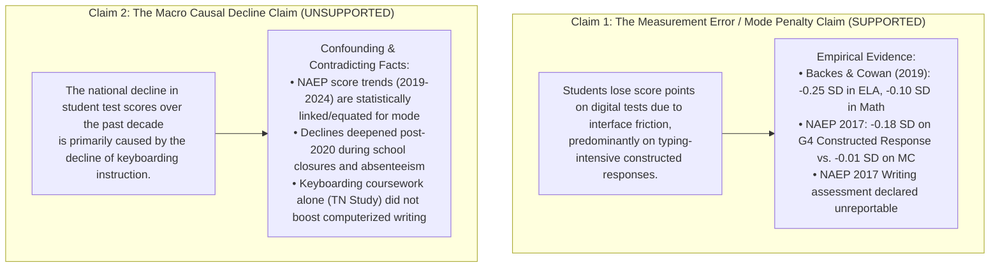

# Research Design & Empirical Framework: Keyboarding, Digital Assessments, and Measurement Error (`2026-10-09-keyboarding-mode-effects`)

An empirical and psychometric investigation examining the divergence between widespread student device access, declining formal keyboarding coursework, and digital assessment mode effects.

---

## 1. Central Problem Formulation

Over the past two decades, American primary and secondary education underwent three simultaneous structural transformations:
1. **Universal 1-to-1 Device Access**: Public schools expanded student access to computing devices from ~5% in 2000 to **88.0%** in 2024–25 (NCES School Pulse Panel).
2. **Collapse of Dedicated Keyboarding Coursework**: The proportion of high school graduates earning credit in dedicated keyboarding collapsed from **44.1% in 2000 to 2.5% in 2019** (NCES High School Transcript Study, Table 1).
3. **Universal Digital Assessment Mandates**: State standardized tests (PARCC, Smarter Balanced, state-specific platforms) and federal monitoring assessments (NAEP reading and mathematics in 2017) transitioned from paper-and-pencil administration (PBA) to digitally based assessments (DBA).

When educational assessments require students to demonstrate complex reading, mathematics, and writing proficiency through digital interfaces, the testing medium itself can introduce **Construct-Irrelevant Variance (CIV)**. If students lack transcription fluency (typing speed, keyboard layout familiarity, screen navigation), their measured performance reflects both their true academic knowledge and their interface friction.

---

## 2. Epistemic Demarcation: Claim 1 vs. Claim 2

To maintain scientific integrity, we draw an absolute boundary between two distinct empirical claims:

### Claim 1: The Construct-Irrelevant Interface Penalty (Empirically Researchable & Supported)
- **Proposition**: Requiring students—especially young elementary students—to type extended written responses on digital tests introduces a significant downward score penalty relative to paper administration.
- **Psychometric Status**: Construct-Irrelevant Difficulty (Messick 1989). Motor transcription bottlenecks consume working memory capacity that would otherwise be allocated to higher-order cognitive formulation, text planning, and conceptual elaboration (Berninger's Simple View of Writing).
- **Evidentiary Support**: Replicated across state quasi-experiments (Massachusetts, South Carolina) and federal equating studies (NAEP 2017).

### Claim 2: The Macro Score Decline Attribution (Causally Unsubstantiated)
- **Proposition**: Keyboarding instruction declines explain national longitudinal drops in test scores (such as NAEP 2019–2024 score declines).
- **Epistemic Flaw**: NAEP implemented sophisticated statistical mode equating and linking in 2017 specifically to isolate and remove mode differences from historical trend reporting. Subsequent declines in 2022 and 2024 occurred *within* an already digital administration environment, coinciding with severe pandemic disruptions, chronic absenteeism, and foundational curriculum changes.
- **Scientific Decision**: We reject Claim 2 as a research premise and quarantine it from causal modeling. We restrict our inquiry to Claim 1: measuring interface friction and construct-irrelevant measurement error.

---

## 3. Formal Psychometric and Econometric Model

### A. Classical Test Theory with Interface Error
Under classical test theory, observed score $X_{ijs}$ for student $i$ on item $j$ under mode $s \in \{\text{Paper}, \text{Digital}\}$ is:
$$X_{ijs} = T_{ij} + E_{ijs}^{\text{random}} + E_{ijs}^{\text{interface}}$$

Where:
- $T_{ij}$: True latent academic competence of student $i$ on construct $j$.
- $E_{ijs}^{\text{random}} \sim \mathcal{N}(0, \sigma_e^2)$: Classical white-noise measurement error.
- $E_{ijs}^{\text{interface}}$: Construct-irrelevant interface friction error.

Under paper testing ($s = \text{Paper}$):
$$E_{ij, \text{Paper}}^{\text{interface}} = 0$$

Under digital testing ($s = \text{Digital}$):
$$E_{ij, \text{Digital}}^{\text{interface}} = \delta_{\text{mode}} + \gamma_{\text{format}} \cdot \mathbb{I}(\text{Format}_j = \text{CR}) + \beta_{\text{typing}} \cdot \max(0, \tau - \text{WPM}_i) \cdot \mathbb{I}(\text{Format}_j = \text{CR})$$

Where:
- $\delta_{\text{mode}}$: Baseline screen-reading and device navigation penalty (general mode effect).
- $\gamma_{\text{format}}$: Specific penalty associated with digital constructed response entry (text entry boxes, equation editors).
- $\tau$: Critical transcription fluency threshold (estimated at $\approx 25$ words per minute, WPM). Below this threshold, typing is non-automatic ("hunt-and-peck"), shifting cognitive load to physical keystrokes.
- $\beta_{\text{typing}} < 0$: Marginal penalty per WPM deficit below threshold $\tau$.

### B. Econometric Specification for Mode Penalty Estimation
Following Backes & Cowan (2019), the mode effect $\beta_1$ is estimated in a difference-in-differences or student fixed-effects framework:
$$Y_{ist} = \alpha_i + \lambda_t + \beta_1 \text{Digital}_{st} + \mathbf{X}_{it}\mathbf{\Gamma} + \epsilon_{ist}$$
Where:
- $Y_{ist}$: Standardized score of student $i$ in school $s$ at year $t$.
- $\text{Digital}_{st}$: Indicator for digital test administration.
- $\beta_1$: The standardized mode penalty ($\text{SD}$).

To isolate the keyboarding / item-format mechanism, we interact administration mode with item type:
$$Y_{ikst} = \mu_k + \beta_1 \text{Digital}_{st} + \beta_2 (\text{Digital}_{st} \times \text{ConstructedResponse}_k) + \mathbf{X}_{it}\mathbf{\Gamma} + \epsilon_{ikst}$$
- **Identification Hypothesis 1 (The Format Wedge)**: $\beta_2 < 0$, indicating that constructed responses suffer an incremental penalty over multiple-choice questions.
- **Identification Hypothesis 2 (The Developmental Wedge)**: $|\beta_2^{\text{Grade 4}}| > |\beta_2^{\text{Grade 8}}|$, indicating that younger students experience greater keyboarding impairment.

---

## 4. The Six-Point Study Admission Gate

Following the rigorous standards of the Computational Sketchbook, this investigation adheres to the Six-Point Admission Gate:

1. **Retrieval & Usability**: All primary sources (NCES HSTS Table 1, NCES Pulse 2025, EdWeek 2024 survey, ICILS 2018/2023, NAEP 2017 Mode Evaluation) are retrieved and ingested into audited CSV/Parquet panels.
2. **Fixed Population & Denominator**: Clear definitions of the benchmark samples (e.g., nationally representative high school cohorts for HSTS, Grades 5–8 for MA PARCC, Grade 4 and Grade 8 for NAEP).
3. **Written Mathematical Model**: The formal CTT error decomposition and regression interaction models are explicitly written above.
4. **Directional Neutrality**: A finding that digital testing incurs no penalty on multiple-choice items, or that keyboarding classes alone yield null writing benefits, substantively advances the research without bias.
5. **Audited Sensitivity Check**: Bounding parameter uncertainty across studies (e.g., contrasting Massachusetts $-0.25$ SD with South Carolina $-0.09$ SD and Tennessee $+0.04$ SD).
6. **Scholarly & Survey Integrity**: Full transparency regarding NAEP's decision to suppress the 2017 Writing assessment due to insurmountable device incomparability.
